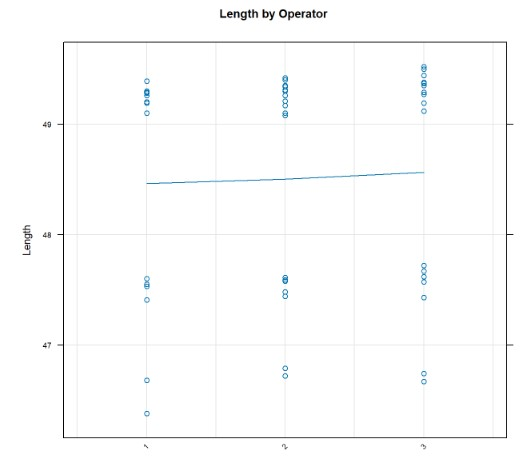

```{=html}
<style type="text/css">
  body{
  font-size: 20pt;
}
.main-container {
  max-width: 1800px;
  margin-left: auto;
  margin-right: auto;
}
</style>
```

```{r setup, include=FALSE}
knitr::opts_chunk$set(echo = TRUE)
```

# Gage R&R study {.tabset}

## GAGE R&R

The Gage R&R method is used to measure variables of production and confirm that the variation is found to not be excessive or to take action if the variation is found to be excessive.

The GAGE R&R Focuses on 2 key aspects

-   **Repeatability:** This refers to how much variation happens when the same person measures the same part multiple times using the same tool. In other words, if one person keeps measuring the same thing with the same instrument, how consistent are the results?

-   **Reproducibility:** This refers to the difference in measurements when different people use the same tool to measure the same part. In other words, if multiple people measure the same thing with the same instrument, how much do their results vary?

```{r, echo=FALSE, results=TRUE, fig.align='center', fig.height=14, fig.width=30}


```

``` {align="center" style="color:gray"}
sixsigmastudyguide   
```

## The GAGE R&R Study Overview

The study was done with 3 people measuring the same 10 parts twice for total of 60 measurements.All the measurements were recorded and then collected to be later used in RStudio for results.

```{r, echo=FALSE, results=TRUE, fig.align='center'}


```

```{r echo=FALSE, results=TRUE, fig.height=20, fig.width=14}


# Data for 10 parts, 3 operators and 2 measurements per part

Operator<- factor(rep(1:3, each = 20))

Part<- factor(rep(rep(1:10, each = 2), 3))

# When inputting #operator data: part 1, part 1, part 2, part 2 etc.

Length<-c(49.26,49.28,47.41,47.41,49.19,49.20,47.55,47.53,49.30,49.26,#op1
  
  
      46.38,46.68,  49.39,49.39,  49.10,49.1,   49.29,49.30,  47.60,47.6,

            ##########################
     49.35, 49.26,  47.44,47.48,  49.17,  49.21,  47.58, 47.59, 49.30,  49.31,#op2
      
      

            46.72, 46.79, 49.40, 49.42, 49.08, 49.1, 49.31,  49.34, 47.58, 47.61,

            ##########################

            49.44,   49.37,47.57,   47.43,49.29,   49.27,47.62, 47.67, 49.52, 49.38, #op3
     
     46.74,  46.67, 49.5,  49.44, 49.12, 49.19,  49.38, 49.35, 47.62, 47.72

    )

Data<-data.frame(Part,Operator,Length); print(Data)


#Load package

library("SixSigma")


#Perform gage R & R

ss.rr(var = Length, part = Part, appr = Operator, data = Data,

             

               main = "Six Sigma Gage R&R Study",

               sub = "",

               alphaLim = 0.05,

               errorTerm = "interaction",

               digits = 4,

               method = "crossed",

               print_plot = TRUE,

               signifstars = TRUE)
```

### **% Contribution**

-   The total Gage R&R contribution is 0.51%, which falls within the acceptable limit.

-   Repeatability accounts for 0.27%, while reproducibility is 0.23%, showing no significant difference between the two.

-   The largest source of variance comes from part-to-part variation, confirming that the measurement system is adequate.

### **% Study Variance**

-   The total Gage R&R contribution is 7.11%, staying within the acceptable threshold of less than 10%.

-   Repeatability is 5.23%, and reproducibility is 4.82%, with no notable differences between them.

-   Once again, the majority of variance is attributed to part-to-part variation.

## Theory

**Process Capability** - relates to the normal variations inherent in the output when the process is in statistical control. By definition, process capability equals 3 standard deviations about the mean output value (a total of 6 standard deviations).

𝑃𝐶 = 𝜇 ± 3𝜎\_\_\_\_\_\_\_\_\_\_\_\_\_\_\_\_\_\_\_\_\_\_\_\_\_\_\_\_\_\_\_\_\_\_\_\_\_\_\_\_ Equation 1

**Process capability index:**

𝑃𝐶𝐼 =$\frac{T_R}{6𝜎}$ \_\_\_\_\_\_\_\_\_\_\_\_\_\_\_\_\_\_\_\_\_\_\_\_\_\_\_\_\_\_\_\_\_\_\_\_\_\_\_\_\_\_𝐸𝑞𝑢𝑎𝑡𝑖𝑜𝑛 2

**Process Capability, C~p~:** Estimates what the process is capable of producing if the process mean were to be centered between the specification limits. Assumes process output is approximately normally distributed

C~p~=$\frac{USL-LSL}{6𝜎}$ \_\_\_\_\_\_\_\_\_\_\_\_\_\_\_\_\_\_\_\_\_\_\_\_\_\_\_\_\_\_\_\_\_\_\_\_\_\_\_𝐸𝑞𝑢𝑎𝑡𝑖𝑜𝑛 3

**Process Capability Index, CPK:** Estimates what the process is capable of producing, considering that the process mean may not be centered between the specification limits. If the process mean is not centered, CP overestimates process capability.

C~PK~=[C~pu~,C~pl~]=min[$\frac{USL-𝜇}{3𝜎}$,$\frac{𝜇-LSL}{3𝜎}$] \_\_\_\_\_\_\_\_\_\_\_\_\_\_\_\_ 𝐸𝑞𝑢𝑎𝑡𝑖𝑜𝑛 4

**Taguchi capability index** estimates process capability around a target, T and is always greater than zero. This function assumes process output is approximately normally distributed.

C~PM~=$\frac{C_p}{\sqrt{1+(\frac{𝜇-T}{𝜎
})^2}}$ \_\_\_\_\_\_\_\_\_\_\_\_\_\_\_\_\_\_\_\_\_\_\_\_\_\_\_\_\_\_\_\_\_\_\_\_\_\_\_ 𝐸𝑞𝑢𝑎𝑡𝑖𝑜𝑛 5

**Control Chart Theory** The goal of most control chart projects is to determine the process capability. This theory outlines how control charts are developed for measurements taken on m sub-groups, with each group consisting of n individuals.

The grand mean of the sub-group means is given as: $\overline{x}$

The grand mean sub-group range is given as:$\overline{R}$

Control limits for the Mean Chart. Note the centreline is the average.

𝐶𝑒𝑛𝑡𝑟𝑒𝑙𝑖𝑛𝑒 = 𝑥̅ \_\_\_\_\_\_\_\_\_\_\_\_\_\_\_\_\_\_\_\_\_\_\_\_\_\_\_\_\_\_\_\_\_\_\_\_\_\_\_𝐸𝑞𝑢𝑎𝑡𝑖𝑜𝑛 5

𝑈𝐶𝐿~x~ = 𝑥̅+ 𝐴~2~$\overline{R}$ \_\_\_\_\_\_\_\_\_\_\_\_\_\_\_\_\_\_\_\_\_\_\_\_\_\_\_\_\_\_\_\_\_\_\_\_\_\_\_𝐸𝑞𝑢𝑎𝑡𝑖𝑜𝑛 6

𝐿𝐶𝐿~R~= 𝑥̅− 𝐴~2~$\overline{R}$ \_\_\_\_\_\_\_\_\_\_\_\_\_\_\_\_\_\_\_\_\_\_\_\_\_\_\_\_\_\_\_\_\_\_\_\_\_\_\_𝐸𝑞𝑢𝑎𝑡𝑖𝑜𝑛 7

Control limits for the Range Chart

𝐶𝑒𝑛𝑡𝑟𝑒𝑙𝑖𝑛𝑒 = $\overline{R}$\_\_\_\_\_\_\_\_\_\_\_\_\_\_\_\_\_\_\_\_\_\_\_\_\_\_\_\_\_\_\_\_\_\_\_\_\_\_\_ 𝐸𝑞𝑢𝑎𝑡𝑖𝑜𝑛 8

𝑈𝐶L~R~ =D~4~ $\overline{R}$ \_\_\_\_\_\_\_\_\_\_\_\_\_\_\_\_\_\_\_\_\_\_\_\_\_\_\_\_\_\_\_\_\_\_\_\_\_\_\_𝐸𝑞𝑢𝑎𝑡𝑖𝑜𝑛 9

𝐿𝐶𝐿~R~ =D~3~ $\overline{R}$ \_\_\_\_\_\_\_\_\_\_\_\_\_\_\_\_\_\_\_\_\_\_\_\_\_\_\_\_\_\_\_\_\_\_\_\_\_\_\_ 𝐸𝑞𝑢𝑎𝑡𝑖𝑜𝑛 10

The standard deviation (σ~est~) is found as follows:

𝜎~est~ =$\frac{\overline{R}}{d_2}$ \_\_\_\_\_\_\_\_\_\_\_\_\_\_\_\_\_\_\_\_\_\_\_\_\_\_\_\_\_\_\_\_\_\_\_\_\_\_\_𝐸𝑞𝑢𝑎𝑡𝑖𝑜𝑛 11

## Results

|                 |   VarComp   | %Contrib |
|:---------------:|:-----------:|:--------:|
| Total Gage R&R  | 0.005590729 |   0.51   |
|  Repeatability  | 0.003025417 |   0.27   |
| Reproducibility | 0.002565313 |   0.23   |
|    Operator     | 0.002565313 |   0.23   |
|  Part-to-part   | 1.099021227 |  99.49   |
| Total Variation | 1.104611956 |   100    |

|                 |   StdDev   | StudyVar  | %StudyVar |
|:---------------:|:----------:|:---------:|:---------:|
| Total Gage R%R  | 0.07477118 | 0.4486271 |   7.11    |
|  Repeatability  | 0.05500379 | 0.3300227 |   5.23    |
| Reproducibilty  | 0.05064891 | 0.3038935 |   4.82    |
|    Operator     | 0.05064891 | 0.3038935 |   4.82    |
|  Part-to-Part   | 1.04834213 | 6.2900528 |   99.75   |
| Total Variation | 1.05100521 | 6.3060313 |  100.00   |

```{r echo=FALSE, fig.align='center', fig.height=5, fig.width=5, results=TRUE}





```

## In-depth Analysis

------------------------------------------------------------------------

**Components of Variation Graph**

The components of variation graph shows the variation from the sources of measurement error. It can be seen thata part-to-part variability is the higher than repeatability and reproducibility variability. it can also be seen that GAGE R&R variability is unde 10% which is withing the limits, therefore an acceptable result.

```{r echo=FALSE, fig.align='center', fig.height=10, fig.width=10, results=TRUE}


```

**R Chart by Operator**

R Chart by operator is used to see whether any points fall above the upper contol limit. as it can be see in the graph below Operator Liam had 1 measurement way out of limits, which could potentially indicate an error with the operator measurement instead of an error with the part or measuring device

```{r echo=FALSE, fig.align='center', fig.height=10, fig.width=10, results=TRUE}


```

**Xbar Chart by Operator**

Xbar Chart is used to show if most points fall beyond the control limits. In a GAGE R&R study the parts should represent a typical part-to-part variability. This means there should be more variation between part avareges, therefore most of the measurements should fall beyond the control limits as can be seen in the graph below

```{r echo=FALSE, fig.align='center', fig.height=10, fig.width=10, results=TRUE}


```

**Length by Part**

Length by part graph shows how close the multiple measurements for the part are. Measurements that are close together indicate small variances between the measurements of the same part. In the graph below it can be seen that there are few noticable outliers in the data.

```{r echo=FALSE, fig.align='center', fig.height=10, fig.width=10, results=TRUE}


```

**Length by Operator**

Length by operator graph shows the differences between operators vs parts. a straight horizontal line means the measurements for each operator are similar, however the line in the graph below is not actually a straight horizontal line, which indicates that the measurements for each operator do not vary an equal amount.

```{r echo=FALSE, fig.align='center', fig.height=10, fig.width=10, results=TRUE}


```

**The Operator\*Part Interaction**

The operator\*part interaction graph shows whether the lines connecting measurements from each operator are similar or they cross each other. Lines that are not parallel or that cross indicate that the operator ability to measure a part consistently depends on which part is being measured.

```{r echo=FALSE, results=TRUE, fig.height=8, fig.width=12, fig.align='center'}


```

**Boxplot**

The boxplot below reveals clear outliers in the data. While the median mea surement for all operators falls within the range of 49–49.5, some values slightly above the median are acceptable. However, there are also measurements that fall significantly below the median, which could indicate a potential issue with the machine. Given that the plots exhibit similar median, minimum, and maximum values across operators, it is reasonable to conclude that the problem likely stems from the machine producing inadequate parts.

```{r echo=FALSE, results=TRUE, fig.height=8, fig.width=12, fig.align='center'}

library(ggpubr)
library(gt)

Length<-c(49.26,49.28,47.41,47.41,49.19,49.20,47.55,47.53,49.30,49.26, 46.38,46.68,  49.39,49.39,  49.10,49.1,   49.29,49.30,  47.60,47.6, 49.35, 49.26,  47.44,47.48,  49.17,  49.21,  47.58, 47.59, 49.30,  49.31, 46.72, 46.79, 49.40, 49.42, 49.08, 49.1, 49.31,  49.34, 47.58, 47.61, 49.44,   49.37,47.57,   47.43,49.29,   49.27,47.62, 47.67, 49.52, 49.38,46.74,  46.67, 49.5,  49.44, 49.12, 49.19,  49.38, 49.35, 47.62, 47.72 )
Operator <- c("Jeff","Jeff","Jeff","Jeff","Jeff","Jeff","Jeff", "Jeff", "Jeff", "Jeff", "Liam","Liam","Liam","Liam","Liam","Liam","Liam", "Liam", "Liam", "Liam", "Jolanta","Jolanta","Jolanta","Jolanta","Jolanta","Jolanta","Jolanta", "Jolanta", "Jolanta", "Jolanta")

mydata <- data.frame(Operator,Length)

ggboxplot(mydata, x = "Operator", y = "Length",
 order = c("Jeff", "Liam", "Jolanta"),
 ylab = "Length(mm)", xlab = "Operator")

res.aov <- aov(Length ~ Operator, data = mydata)

mydata3 <- summary(res.aov)

mydata3
```

**Capability Analysis**

```{r echo=FALSE, results=TRUE, fig.height=8, fig.width=12, fig.align='center'}
library(qcc)

chartdata <- read.table(header = FALSE, text = "
49.26 49.28 47.41 47.41 49.19 49.20 47.55 47.53 49.30 49.26
46.38 46.68 49.39 49.39 49.10 49.1 49.29 49.30  47.60 47.6  ")


xbar <- qcc(data = chartdata,
 type = "xbar",
 sizes = 10,
 title = "Sample X-bar Chart Title",
 digits = 10,
 plot = TRUE,bg.margin = "white", bg.figure = "white")
# R Chart
rbar <- qcc(data = chartdata,
 type = "R",
 sizes = 10,
 title = "Sample R Chart Title",
 digits = 10,
 plot = TRUE,bg.margin = "white", bg.figure = "white")
# Determine the Process Capability
process.capability(xbar,spec.limits=c(46,50),target= 49)
```

## Conclusions

The Gage R&R study indicates that the measurement system is within acceptable limits, with variability due to Gage R&R being under 10%. The part-to-part variation is the most significant contributor to total variation, which is expected and desirable in a well-functioning system. While most operators performed consistently, one operator had an out-of-limit measurement, highlighting potential operator-based variability. Additionally, the boxplot analysis suggests that some measurements fall significantly below the median, indicating possible machine-related inconsistencies.

## Discussion

The findings of this study reinforce the reliability of the measurement system but also highlight areas for improvement. The outlier detected in the R chart suggests that operator training or measurement standardization may be necessary to reduce variability. Furthermore, the observed deviations in the length-by-operator and operator-part interaction graphs indicate that individual operators may not measure consistently across different parts, potentially affecting reproducibility. The process capability analysis shows that while the system is functional, there is room to improve precision, especially in reducing variation near the lower specification limit. Future studies could explore optimizing the measurement process, recalibrating instruments, or enhancing operator training to ensure more consistent results.

## DkIT Declaration

```{r, echo=FALSE, results=TRUE, fig.align='center'}


```

DECLARATION: I declare that:

-   This work is entirely my own, and no part of it has been copied from any other person’s words or ideas, except as specifically acknowledged through the use of inverted commas and in-text references;

-   No part of this assignment has been written for me by any other person except where such collaboration has been authorised by the lecturer concerned;

-   I understand that I am bound by DkIT Academic Integrity Policy. I understand that I may be penalised if I have violated the policy in any way;

-   I have not used generative artificial intelligence (AI) (e.g. ChatGPT) unless it has been permitted by the lecturer(s) concerned;

-   This assignment has not been submitted for any other module at DkIT or any other institution, unless authorised by the relevant Lecturer(s);

-   I have read and abided by all of the requirements set down for this assignment.

TYPED SIGNATURE: Jolanta Puzule

DATE: 06/03/2025

## References

1.  Quality-one.com. (2015). *Gage R&R \| Gage Repeatability & Reproducibility \| Quality-One*. [online] Available at: <https://quality-one.com/grr/.>

2.  Anon, (2018). *The Basics of Gage R&R \| GAGEtrak Calibration Management Software*. [online] Available at: <https://gagetrak.com/the-basics-of-gage-rr/.>

3.  Anon, (n.d.). *Six Sigma DMAIC Series in R – Part 1 \| DataScience+*. [online] Available at: <https://datascienceplus.com/six-sigma-dmaic-series-in-r-part-1/.>

4.  support.minitab.com. (n.d.). *Interpret the key results for Crossed Gage R&R Study*. [online] Available at: <https://support.minitab.com/en-us/minitab/help-and-how-to/quality-and-process-improvement/measurement-system-analysis/how-to/gage-study/crossed-gage-r-r-study/interpret-the-results/key-results/.>

    ‌

    ‌

    ‌

    ‌
